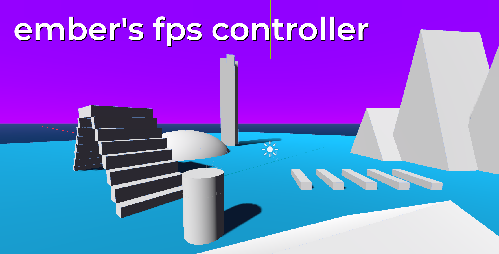

My KinematicBody solution to smooth stairstepping in Godot.

This repo is more a proof of concept than a bonified solution.

# Goals

1. Use a native Godot solution for stair-stepping.
2. Do not separate contact reporting across multiple nodes.
3. Keep the code clear enough for other users to study.

# What does this character controller do?

This controller lets you step on top of objects that are waist-height and lower, without slowing your horizontal velocity like a Capsule collider would. Instead, your character will raise itself to meet the height of the obstacle it's sitting on, and it will never be able to step over an object that's higher than waist-height.

This was meant to be an easier-to-maintain controller that doesn't deal with states, managing a snap vector, handling multiple Raycast nodes in code, or RigidBody's integrate forces function.

As of recently, this controller can jump and sprint. I also recently improved the code a ton so falling down looks less floaty.

# Is there anything I should know before I use it?

Yes. Right now, **really steep slopes are perfectly traversable**. This is not great for 95% games that need a stair-stepping character controller, as only their head width prevents them from climbing up 90 degree walls. I have tried multiple solutions to address this, you're welcome to give it a go. No solution I found was simple and elegant enough to fit the controller's goals.

# What will never be added?

There will never be shooting or interacting with objects. Each game will need different solutions for interacting with other bodies.

# How is this different from other stair-stepping solutions?

There's no code to handle Raycasts. Instead, it uses a RayShape CollisionShape to let GodotPhysics do the snapping up to surfaces. Going down currently just uses gravity and `move_and_slide()`. The camera's y position is interpolated from the player's actual y position to give the illusion of smooth movement, and the smoothness is adjusted depending on the incline and which direction the player is moving.

I wanted this controller to use built-in Godot physics and nodes as the solution. I also wanted it to be simple(r) to maintain and adjust with the current state of GodotPhysics. Unless RayShape is drastically changed, the concept and execution should remain compatible with future versions of Godot.

# Why did you make this?

For one, the Qodot discord has had ages-long discussions about the best ways to step up stairs in the Godot engine. I recommend you join the Qodot Discord and ask the community to explain their ideal way of doing it.

I was inspired by Casey Muratori's 2018 talk [Killing the Walk Monster](https://www.youtube.com/watch?v=YE8MVNMzpbo) which shows a really clever way of stair stepping using two cylinder colliders: A top cylinder to handle horizontal collisions, and a bottom cylinder to handle vertical collisions.

Unfortunately, Godot's KinematicBody and built-in physics lacks the ability to ignore horizontal collisions on a shape, unless the whole thing was written with RigidBody and `_integrate_forces()` and you had experience writing physics engines for games.

I made this as a test to show how I would do it, using as many of Godot's solutions without re-writing too much, and keeping it...marginally simple. It's a bit long in the code and involves a lot of knowledge I've acrued over the years, but I wanted something that looked nice and wasn't completely arcane.

I basically spent as much time on this controller as I probably would've spent had I re-written Godot physics handling with `_integrate_forces()` to get what I wanted. However, this was a useful experiment to see how far I could take KinematicBody in Godot 3.x.

# Where can I see this controller in action?

An earlier, buggier version of this controller has been used in my game [Winter Weather](https://deertears.itch.io/winter-weather), a first person poem-reader.

# Contact

Ember#1765 on Discord, @goodnight_grrl on Twitter. Let me know if you have questions about the controller or want to discuss options for how to improve it. You can also just raise an issue for anything, I'm not picky with this repo.
